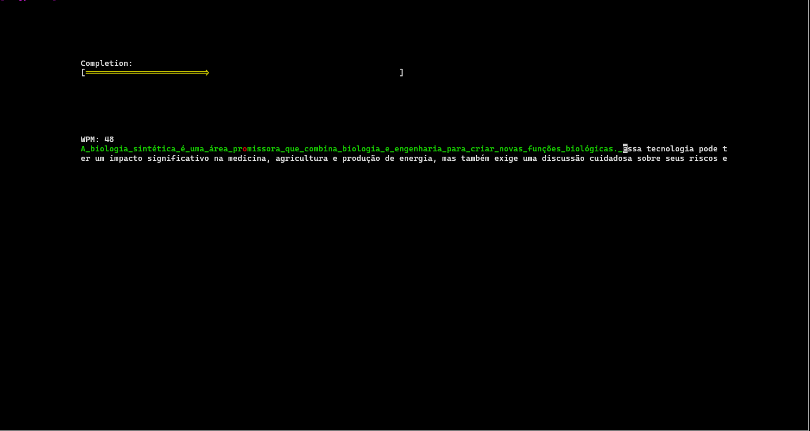

# Typetest

Test you typing skills!



## Build

```bash
cmake -B build
cmake --build build
./build/App/typetest
```

## Todo

- [ ] Centralizar a tela inicial.
- [ ] Melhorar a tela de pontuações.
